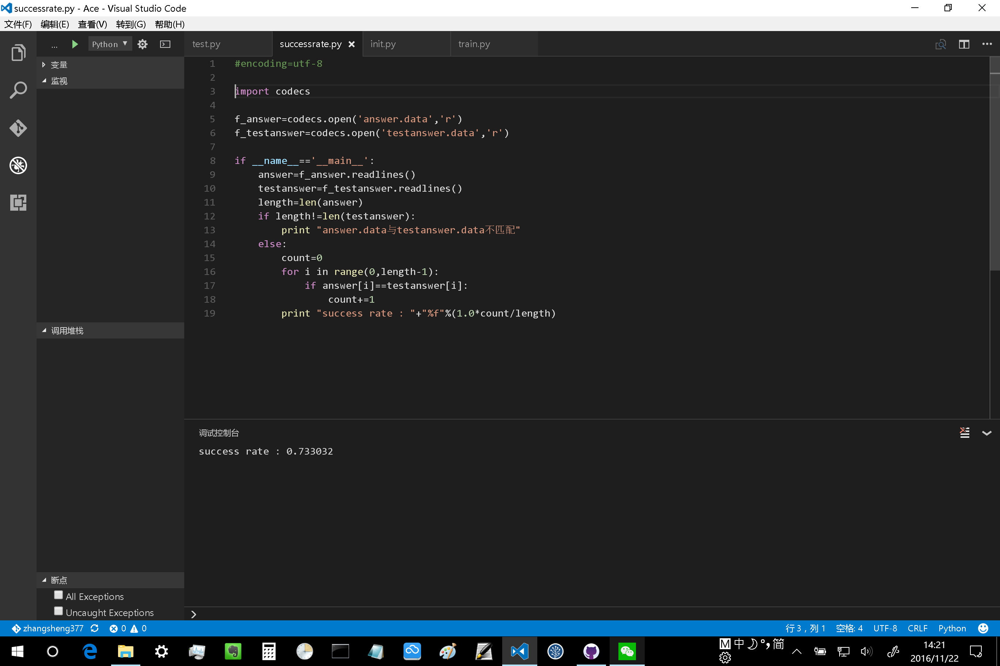

# 注意：
## 由于使用了多线程分词，现在的程序不支持在windows下运行，请使用linux或mac！
## 或者注释掉jieba.enable_parallel(2) 

---------------

# 流程
1. ~~先运行init.py，把train.data_backup分成train.data和test.data，以及answer.data~~ 若已经准备好训练集train.data和测试集test.data，以及测试集的答案answer.data，则并不需要运行第一步，可直接跳到第2步开始执行
2. 再运行train.py，对train.data进行训练，生成训练参数文件parameter_categorys.dat和parameter_words.dat
3. 再运行test.py，对test.data进行测试，输出testanswer.data
4. 最后运行successrate.py，对比answer.data和testanswer.data，在屏幕上输出正确率。

